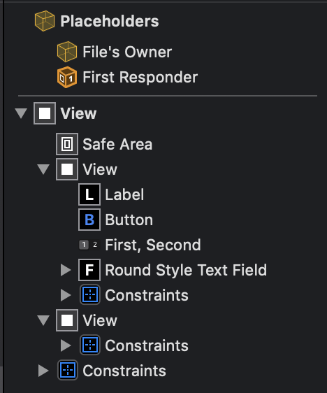

# NibJect

---

(⚠️ WIP ⚠️ )

## How to use

### Preparing the `.xib` file

#### Property naming

Without specifying a custom name the view's label generated from Interface Builder will be used.

[](images/ib-generated-labels.png)
_Interface Builder generated labels_

When a `.xib` file contains multiple views with the same label a number will be appended to differentiate the same types. 

If any view is missing a label a comment will be added to the ejected Swift code containing the Object ID of the view it represents. This can be
useful to point out that a label has not been set.

Example output for a missing label
```
// ObjectID: xoN-7g-NRP; Missing Xcode Label
private lazy var button: UIButton = {
    let view = UIButton()
    view.translatesAutoresizingMaskIntoConstraints = false
    return view
}()
```

You  can use the "ObjectID" to identify the view in Interface Builder. The ObjectID is located in the `xib` within the Identity Inspector pane.
[](images/identity-inspector-pane.png) 

#### Custom property naming

To set a custom name for a view you need to set the Label within Interface Builder. Setting this field will also remove the ObjectID 
comment in the ejected code.

1. Open the `.xib` file
2. Select the view you want to name
3. Open the Identity Inspector Pane (see image above)
4. Add custom name in the field that says "Label" 

### Ejecting a `.xib`

The easiest way to start using Nibject is to provide a `.xib` path.
`nibject --input /path/to/xib/YourView.xib` 
or
`nibject -i /path/to/xib/YourView.xib`

This will generate a Swift file of the same name as the  `.xib` within the current directory.

#### Specifying an output path

To specify an output path use the `--output`, or `-o`, option.
`nibject --input /path/to/xib/YourView.xib --output /path/to/directory` 

## How to install

## Limitations

  1. No Storyboard support
  2. Only supports layout constraints. What this means is most view properties will not be ejected
  3. No supprt for placeholder constraints
  4. No support for compression or hugging priorities
  5. There are certain properties that IBTool does not support. For instance `color` is not supported in the latest version. This means any colors 
  set in `.xib` will not be ejected.

## Details

### Generated Swift file

The generated swift file will contain the following format

```
public class __View Name__: UIView {
    private lazy var __Subview 1 Name__: __Subview 1 Name Class__ = {
        let view = __Subview 1 Name Class__
        view.translatesAutoresizingMaskIntoConstraints = false
        return view
    }()
    
    public init() {
        super.init(frame: .zero)
        setupSubviews()
    }
    
    public required init?(coder: NSCoder) {
        fatalError("init(coder:) has not been implemented")
    }
    
    // MARK: - Layout
    private func setupSubviews() {
        addSubview(__Subview 1 Name__)
        layout__Subview 1 Name__()
    }
    
    private func layout__Subview 1 Name__() {
        // Layout margins
    }
}
```

### Justification

This project started out as a project over a long weekend to explore creating a commandline tool to streamline view creation. It quickly 
became a tool I wanted to use for my work. I prefer programmatic views over `.xib` and Storyboards but sometimes it can be a bit of a drag
to write all of the boilerplate code to wire up the constraints. This seemed like a perfect problem to solve! And thus the creation of NibJect. 
